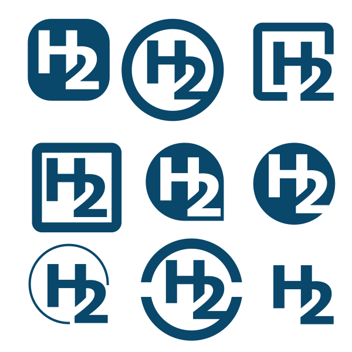

H2 Logos
========

Variant 1
---------
Logos with inverted color for a letter.

Variant 1_1 | Variant 1_2 | Variant 1_3
------------|-------------|------------- 
 |  | 
 *cut*| *concat* | *merge*


Variant 2
---------
Random Logos.

Variant 2_1 | Variant 2_2 | Variant 2_3
------------|-------------|------------- 
 |  | 
 *negative*| *sign* | *ligature*
 
 
Variant 2_3 
------------
Logos with `ligature` variations:

```
files:
  [ 2_3_1   2_3_2   2_3_3 ]
  [ 2_3_4   2_3_5   2_3_6 ]
  [ 2_3_7   2_3_8   2_3_9 ]
```

----

 

----
 
Notes
----- 
For each variant and variation there's a SVG file in this directory. For the *`ligature` variations* there's 
also an assembly file with all 9 for easier comparison. All SVG files were simply created with [Inkscape](https://inkscape.org/en/).  


